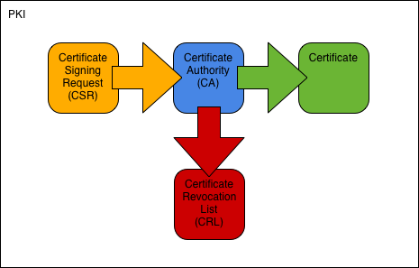

# OpenSSL rootCA (v3)

A x509 certificate generator with Root CA, intermidiate CA, CA database, server certificates and OCSP server, CRL. 

# Links

OpenSSL Cookbook
https://www.feistyduck.com/library/openssl-cookbook/online/

Tutorial
http://pki-tutorial.readthedocs.io/en/latest/advanced/index.html

Sample minimal CA application
https://www.openssl.org/docs/manmaster/man1/openssl-ca.html

ECC key (id-ecPublicKey) which means that this is an ECDSA certificate.
https://wiki.openssl.org/index.php/Command_Line_Elliptic_Curve_Operations

# Pipe line
**1. Create Root CA:**
- Create directories
- Create database and Start numbers
- Create CA request
- Create CA certificate
- Create initial CRL

**2. Create KMS Root CA:**
- Create directories
- Create database and Start numbers
- Create CA request
- Create CA certificate
- Create initial CRL

**3. Create server certificate**
- Create TLS server request
- Create TLS server certificate
- Create PKCS#12 bundle
- Create TLS client request
- Create TLS client certificate
- Create PKCS#12 bundle

**4. Revoke certificate**
- Revoke certificate
- Create CRL
